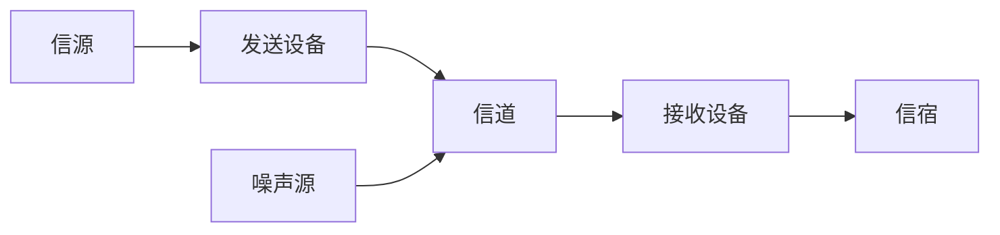

# 计算机网络  

[TOC]

## 一.什么是计算机网络  
* 计算机网络 = 通信技术 + 计算机技术
* 通信系统模型：



**信源** ：发生、产生信息		**信宿**：信息到达的地方  


* 计算机网络就是一种**通信网络**

* 定义：计算机网络就是**互连**的、**自治**的计算机集合。
  * **自治** ：无主从关系
  * **互联** ：互联互通
    * 通信链路  

* 距离远、数量大怎么保证互连？
  * 通过**交换网络**互连主机
    * 交换节点：路由器、交换机

## 二.什么是Internet 

* 全球最大的互联网
  * ISP(Internet Service Provider)网络互连的“网络之网络”
* 互联网：数以百万计的**计算设备**集合：
  * 主机（host） = 端系统（end systems）
  * 运行各种网络应用
  * 各种主机通过**通信链路**连接在一起
    * 通信链路：光纤、铜缆、无线电、卫星
  * 分组交换：转发分组（数据包）
    * 路由器、交换机
* 互联网（服务角度）：为网络应用提供通信服务的通信基础设施
  * 为网络应用提供应用编程接口（API）

## 三.什么是网络协议

* **硬件** （主机、路由器、通信链路等）是计算机网络的基础

* 计算机网络中的数据交换必须遵守实现约定好的**规则** 

  硬件：道路 	规则：交通法则

* **网络协议**：为进行网络中的数据交换而建立的规则、标准或约定

  * 协议规定了通信实体之间所交换的消息的**格式、意义、顺序** 以及收到信息或发生的事件所采取的“**行动**”
  * **协议三要素**
    * 语法（Syntax）
      * 数据与控制信息的结构或格式
      * 信号电平
    * 语义（Semantics）
      * 需要发出何种控制信息
      * 完成何种动作以及做出何种响应
      * 差错控制
    * 时序（Timing）
      * 事件顺序
      * 速度匹配
  * RFC文档：官方文档

## 四.计算机网络结构

1. **网络边缘**
   1. 主机
   2. 网络应用
2. **接入网络，物理介质**
   1. 有线或无线通信链路
3. **网络核心（核心网络）**
   1. 互联的路由器
   2. 网络之网络

### 1.网络边缘

* 主机（端系统）：
  * 位于“网络边缘”
  * 运行网络应用程序
* 客户/服务器应用模型
  * 客户发送请求，接收服务器响应
    * 如：Web应用，文件传输FTP应用
* 对等（P2P）应用模型
  * 无专用服务器
  * 通信在对等实体之间直接进行
    * 如：QQ

### 2.接入网络

* 将网络边缘接入核心网
* 分类
  * 家庭接入网络
  * 机构接入网络
  * 移动接入网络
* 用户关心：
  * 带宽（bps）：每秒传输速率
  * 共享/独占？
* 举例：
  * 数字用户线路（DSL）
    * 多路复用技术
  * 电缆网络
    * HFC：混合光纤同轴电缆
    * 非对称：下行（下载）：30Mbps  上行（上传）：2Mbps
    * 共享
  * 家庭接入网络
  * 机构接入网络
    * 以太网
  * 无线接入网络
    * 无线局域网（wifi）
  * 广域无线接入
    * 蜂窝网（移动网络）：3G、4G

### 3.网络核心

* 互联网的路由器网络
* 网络核心的关键功能：**路由+转发**
  * 路由（routing）：确定分组从源到目的传输路径（查**路由转发表**）
    * 路由算法：形成本地转发表（路由转发表）
  * 转发（forwarding）：将分组从路由器的输入端口交换至正确的输出端口
* 网络核心解决的基本问题
  * 如何实现数据从源主机通过网络核心送达目的主机
    * 数据交换

### 4.Internet结构：网络之网络

* 端系统（主机）通过接入ISP连接到Internet
* 接入ISP必须进一步互连
  * 保证两个主机之间可以互相发送分组
* 构成复杂的网络互连的网络

## 五.数据交换

* 实现数据通过网络核心从源主机到达目的主机
* N^2链路问题
  * 所有主机之间都有一条链路（链路消耗大）
  * 解决方案：**交换设备**
* 交换设备
  * 无法保证连通性和网络规模
  * 解决方案：**交换网络**
* 交换网络
  * 由交换设备组成的网络
  * 动态链接
    * 可以将一个端口的数据转移到另一个端口
  * 动态分配传输资源
    * 数据从源主机通过交换网络正确的送到目的主机

### 1.数据交换的类型

* 电路交换
* 报文交换
* 分组交换

#### 电路交换

* 电路交换的特点
  * 最典型的电路交换网络：电话网络
  * 电路交换的三个阶段
    * 建立连接（呼叫 /电路建立）
    * 通信
    * 释放连接（查出电路）
  * 最重要特点：**资源独享**
* 电路交换网络的链路共享
  * 如何共享中继线
    * **多路复用技术**

##### 多路复用技术

* 多路复用（multiplexing）简称复用，是通信技术中的基本概念
* 共享信道（例如电话、网络共用一条信道）
* **多路复用**
  * 把链路/网络资源（如宽带）划分为“资源片“
  * 将资源片分配给各路呼叫
  * 每路呼叫独占分配到的资源片进行通信
  * 资源片可能”闲置“
* 典型多路复用技术
  * 频分多路复用
  * 时分多路复用
  * 波分多路复用
  * 码分多路复用

###### 频分多路复用

* 根据频率分配信道
  * 频分多路复用的用户占用不同的宽带资源
  * 用户在分配到一定的频带后，在通信过程中始终都占用这个频带

###### 时分多路复用

* 把信道使用时间划分为一段段等长的时分复用帧，每个用户在每个TDM帧中占用固定序号的时隙
  * 每用户所占用的时隙周期出现的
  * 在同一频率传送数据

###### 波分多路复用

* 波分复用就是光的频分复用

###### 码分多路复用（CDM）

* 广泛运用于无线链路共享（蜂窝网、卫星信号）
* 为每个用户分配一个唯一的m比特的码片序列。（由-1（0），+1（1）组成）
* 各用户使用相同频率载波，利用各自码片序列编码数据
  * 编码信号 = （原始数据）* （码片序列）
  * 各用户码片序列相互正交
* 共享信道、互不干扰
  * 所有用户发送数据后，数据会叠加，接收用户需要通过**解码**接收数据
    * **解码**：发送用户的码片序列与编码信号的内积

#### 报文交换

* **报文**：源（应用）发送信息整体（一个文件）

#### 分组交换（统计多路复用）

* **分组**：报文拆出来的一系列相对较小的数据包
  * 需要报文的拆分和重组
  * 产生额外开销（时间、头部信息）
  * 最大特点：**按需分配链路**
  
* 报文交换、分组交换均采用存储、转发交换方式
  * 区别
    * 报文交换以完整报文进行“存储-转发”
    * 分组交换以较小的分组进行“存储-转发”
  * 哪种更好呢？

* **传输延迟** 

  * 从发送第一比特分组开始，到发送最后一比特分组之间的时间
  * **分组交换在空间和时间上都优于报文交换** 


## 六.计算机网络性能

### 1.速率

* 数据传输速率：单位时间(s)传输信息量(bit)
* 单位：m/s(bps)

### 2.带宽

* 通常宽带：信号具有的频带宽度，即最高频率和对最低频率之差，单位：**Hz**
* 网络中带宽：数字信道所能传送的最高数据率，单位：**bps**

### 3.延迟

* 分组交换为什么会发生丢包和时延
  * **时延**：分组交换本身会发生延迟、排队的时间
  * **丢包**：如果路由器缓存满了，到达分组会被丢弃
* 四种分组延迟
  * 结点处理延迟（检查分组正确、确定输出链路）--毫秒级
  * 排队延迟：等待输出链路可用，取决于路由器的拥塞程度
    * R:链路带宽、L:分组长度、a:平均分组到达速率
    * 流量强度：La/R
      * = 0 平均排队时间很小
      * = 1 平均排队时间很大
      * 大于1 排队时间无限大
  * 传输延迟：却决于分组长度和链路带宽
  * 传播延迟(d/s)：物理链路长度d，信号传播速度s
    * **与传输延迟完全不同**

### 4.带宽时延积

* 时延带宽积 = 传播时延 * 带宽
* 以比特为单位的链路长度

### 5.分组丢失

* 丢包率：丢包数/已发送包数

### 6.吞吐量

* 从发送端到接收端之间传送数据速率
  * 即时吞吐量：给定时刻的速率
  * 平均吞吐量：一段时间的平均速率
* 吞吐量取决于**瓶颈链路**

## 七.计算机网络体系结构

* Q:是否存在一种系统结构有效描述网络
  * 分层结构
  * 网络体系结构是从**功能上**描述计算机网络结构
  * 每层遵循某些网络协议完成本层功能
  * 计算机网络体系结构是计算机网络的各层及协议的集合
  * 体系结构是**抽象的**

* Q:为什么采用分层结构
  * 结构清晰，有利于识别复杂系统的部件及其关系
  * 模块化的分层易于系统更新、维护
  * 有利于标准化

### 1.基本概念

1. **实体**：表示任何可以发送或接收信息的硬件或软件进程
2. **协议**：控制两个对等实体进行通信的规则的集合，协议是“水平的”
3. 任一层实体需要**使用下层服务，遵循本层协议，实现本层功能，向上层提供服务**，**服务是垂直的**
4. 下层协议的实现对上层的服务用户是透明的
5. 同系统的相邻层实体间通过**接口**进行交互，通过服务访问点SAP，交换**原语**，指定请求的特定服务。

### 2.OSI参考模型

* 目的：支持**异构网络系统**的互联互通
  * 理论成功，市场失败
* 7层功能，每层完成特定的网络功能

#### OSI参考模型解释的通信过程


* 上四层：端-端层；下四层：非端-端层


* PDU（协议数据单元）
* Q:为什么要数据封装
  * 增加**控制信息**
    * 构造协议数据单元
  * **控制信息**主要包括：
    * 地址：表示发送端/接收端
    * 差错检测编码：用于差错检测或纠正
    * 协议控制：实现协议功能的附加信息

##### 非端-端

###### 1. 物理层

1. 定义**接口特性**
   1. 机械特性（接口的几何形状）
   2. 电气特性（使用电平大小、电压大小）
   3. 功能特性（引脚个数和功能）
   4. 规程特性（接口要遵循的过程）
2. 比特编码
3. 数据率（数据传输速率）
4. 比特同步
   1. 时钟同步
5. 传输模式
   1. 单工（simplex）：单向（传统电视）
   2. 半双工（half-duplex)：可以双向通信，只能交替进行（对讲机）
   3. 全双工（full-duplex):可以同时双向通信

###### 2. 数据链路层

1. 负责结点-结点数据传输，数据**以帧为数据单位**进行传输
2. 组帧（framing）：加头加尾
3. 物理寻址（标识数据（在帧头）以确定比特数据被正确结点（主机）接收）
4. 流量控制
5. 差错控制
6. 访问控制

###### 3. 网络层

1. 负责源主机到目的主机数据分组交付
   1. 可能穿越多个网络
2. 逻辑寻址
   1. 全局唯一逻辑地址，确保数据本组被送达目的主机（IP地址）
3. 路由
   1. 路径选择
4. 分组转发

##### 端-端

###### 1. 传输层

1. 负责源-目的（进程间）完整报文传输
2. 负责报文的分段和重组
3. SAP寻址（端口号）
4. 连接控制
5. 流量控制
6. 差错控制

###### 2. 会话层

1. 对话控制（建立、维护）
2. 同步（在数据流中插入”会话点“）
3. 最”薄“的一层

###### 3. 表示层

1. 处理两个系统间交换信息的语法和语义问题
2. 数据表示转化（转换为主机独立的编码）
3. 加密/解密
4. 压缩/解压缩
5. internet：没有这一层，在应用层中包含

###### 4. 应用层

1. 支持用户通过用户代理（浏览器）或网络接口使用网络（服务）
2. 典型应用层服务
   1. FTP（文件）、SMTP（电子邮电）、HTTP（Web）

### 3. TCP/IP参考模型


* Everything over IP

### 4. 五层参考模型


## 八.网络应用层

### 1.体系结构

1. 客户机/服务器结构（C/S）
2. 点对点结构（P2P）
3. 混合结构（Hybrid）

#### 1. C/S结构

1. **C:服务器**（提供服务的软件）
   1. 全时间不间断服务
   2. 永久可访问域名
   3. 利用大量服务器实现可拓展性
2. **S:客户机**（使用服务）
   1. 间歇性接入网络
   2. 可以使用动态IP地址
   3. 不会与其他客户机直接通信
3. 例：Web

#### 2. P2P结构

1. 没有永远在线的服务器
2. 任意端系统/节点之间可以直接通讯
3. 节点可以间歇性接入网络
4. 节点可以改变IP地址

**优点**：高度可伸缩

**缺点**：难以管理

#### 3. 混合结构

* 混合C/S结构和P2P结构

### 2.网络应用进程通信

* 进程：主机运行的程序
* 不同主机间运行的进程间如何通信
  * **报文交换**

* **客户机进程**：发送通信的进程
* **服务器进程**：等待通信请求的进程
* **套接字（Socket）**
  * 发送方将消息送到门外邮箱
  * 发送方依赖传输设施将消息传到接收方所在主机，并送到接收方的门外
  * 接收方从门外获取消息
  * **传输基础设施向进程提供API**
    * 传输协议的选择
    * 参数的设置
* 如何寻址进程
  * 不同主机间通信，每个进程必须拥有**标识符**（IP+端口号）
    * 如何寻址主机
      * IP地址
      * 端口号
        * 每一个需要通信的进程分配一个端口号（HTTP-80、MailServer-25）
* **应用层协议**
  * 网络应用需遵循应用层协议
  * 公开协议：由RFC定义——允许互操作
  * 私有协议：多数P2P文件共享应用
  * 内容
    * 消息的类型
      * 请求消息
      * 响应消息
    * 消息的语法
      * 消息中的字段
      * 每个字段如何描述
    * 字段的语义
      * 字段中信息的含义

### 3.网络应用的需求与传输层服务

1. 需求

   1. 数据丢失/可靠性
   2. 时间/延迟
   3. 带宽

2. Internet提供的传输服务

   1. TCP服务
      * 面向连接：客户机/服务器进程间需要建立连接
      * 可靠的传输
      * 流量控制
      * 拥塞控制
      * 不提供时间/延迟保障
      * 不提供最小带宽保障

   1. UDP服务
      * 无连接
      * 不可靠的数据传输
      * 不提供：可靠性保障、流量控制、拥塞控制、延迟保障、带宽保障
      * **自由！**


### 4.Web应用

World Wide Web

发明者：Tim Berners-Lee

* 构成：网页、网页互相链接
* 网页包含多个对象
  * 对象：HTML、JPEG图片、视频、动态脚本
  * 基本HTML文件：包含对其它对象引用的链接
* 对象的寻址
  * URL：统一资源定位器 RFC1738
    * Scheme(协议)://host(主机域名):port(端口号)/path(路径)
* HTTP协议概述
  * 万维网遵循HTTP(HyperText Transfer Protocol)协议
  * C/S结构
    * 客户：请求、接收、展示Web对象
    * 服务器：响应客户的请求，发送对象
  * 使用TCP传输服务
    * 服务器在80端口等待客户的请求
    * 浏览器发送到服务器的TCP连接(创建套接字Socket)
    * 服务器接收来自浏览器的TCP连接
    * 浏览器（HTTP客户端）与Web服务器(HTTP服务器)交换HTTP消息
    * 关闭TCP连接
  * 无状态协议
    * 服务器不维护任何有关客户端过去所发送的信息
    * **有状态的协议更复杂**
      * 需要维护
      * 服务器失效，会产生状态不一致
* HTTP连接
  * HTTP连接的两种类型
    * 非持久性连接
      * 每个TCP连接最多允许传输一个对象
      * 例：
        * 假定用户在浏览器中输入URL：www.someSchool.edu/someDepartment/home.index
        * 步骤
          * 1. HTTP客户端向地址的服务器上的HTTP服务器进程（端口80）发起TCP连接请求
            2. HTTP服务器在端口80等待TCP连接请求，接收连接并通知客户端
            3. HTTP客户端将HTTP请求消息（包含URL地址）通过TCP连接的套接字发送，消息中所含的URL表明客户端所需要对象
            4. HTTP服务器收到请求消息，解析，产生包含所需要对象的响应消息，并通过套接字发送给客户端
            5. HTTP服务器关闭TCP连接
            6. HTTP客户端收到响应消息，解析HTML文件，显示HTML文件，发现由10个指向jpeg对象的超链接
            7. 为每个JPEG对象重复步骤1-5
        * 响应时间分析、建模
          * RTT(Round Trip Time):从客户端发送一个很小的数据包到服务器并返回所经历的时间
          * 响应时间：
            * 发起、建立TCP连接：1RTT
            * 发送HTTP请求消息到HTTP响应消息的前几个字节到达：1RTT
            * 响应消息中所含文件的传输时间
            * TOTAL = 2RTT + 文件传输时间
        * 问题：
          1. 每个对象都需要2个RTT
          2. 操作系统需要为每个TCP连接开销资源
    * 持久性连接
      * 每个TCP连接允许传输多个对象
      * 发送响应后，服务器保持TCP连接的打开，后续的HTTP消息可以通过这个连接发送
      * 1. 无流水的持久性连接
           * 客户端只有收到前一个响应后才发送新的请求
           * 每个被引用的对象耗时1个RTT
        2. 带有流水机制的持久性连接
           * 客户端只要遇到一个引用对象就尽快发出请求
           * 理想情况下，收到所有的引用对象只需耗时约1个RTT

#### HTTP

* HTTP协议有两类消息

  * **请求消息**

    * ASCII码：人直接可读

    * 例:

      ```
      GET /somedir/page.html HTTP/1.1——请求命令：方法+URL+HTTP版本
      头部行：
      Host:www.someschool.edu
      User-agent:Mozilla/4.0——客户端浏览器
      Connection:close——连接：发完可以关闭连接
      Accept-language:fr——支持语言
      ——空格换行：结束
      ```

    * 上传输入的方法
      * Post方法
        * 网页需要填写表格（form）
        * 在请求消息的消息体（entity body）中上传客户端的输入
      * URL方法
        * 使用GET方法
        * 输入信息通过request行的URL字段上传
    * **方法的类型**
      * HTTP/1.0
        * GET、POST、**HEAD**(不要把请求的对象放入响应消息中)
      * HTTP/1.1
        * GET、POST、HEAD、**PUT**（将消息体中的文件上传到URL字段所指定的路径）、**DELETE**（删除URL字段所指定的文件）

  * **响应消息**

    ```
    HTTP/1.1 200 ok——请求正常
    Connection:close
    Date:Thu,06 Aug 1998 12:00:15 GMT——web服务器生成响应消息的时间
    Server:Apache/1.3.0(Unix)——软件类型
    Last-Modified:Mon ,22 Jun 1998.....——上次修改时间
    Content-Length:6821——内容长度
    Content-Type:text/html——内容类型
    ——空行
    data data data data data data ...——数据
    ```

    * HTTP响应状态代码
      * 响应消息的第一行
        * 例：200（OK）、301（Moved Permanently）、400（Bad Request）、404（Not Found）、505（HTTP Version Not Supported）

#### Cookie技术

* 为什么需要cookie技术
  * 很多应用需要服务器掌握服务端的状态

* Cookie技术
  * 某些网站为了辨别用户身份、进行session跟踪而储存在用户本地终端上的数据（通常经过加密）
  * RFC6265
* Cookie的组件
  * HTTP响应消息的cookie头部行
  * http请求消息的cookie头部行
  * 保存在客户端主机上的cookie文件，由浏览器管理
  * Web服务器的后台数据库
* 用于
  * 身份认证
  * 购物车
  * 推荐
  * Web e-mail
* 问题
  * 隐私

#### Web缓存/代理服务器技术

* 在不访问服务器的前提下满足客户端的HTTP请求
* 作用
  * 缩短客户请求的响应时间
  * 减少机构/组织的流量
  * 在大范围内（Internet）实现有效的内容分发
* 实现
  * Web缓存/代理服务器
    * 用户设定浏览器通过缓存进行Web访问
    * 浏览器向缓存/代理服务器发送所有的HTTP请求
      * 如果所请求对象在缓存中，缓存返回对象
      * 否则，缓存服务器向原始服务器发送HTTP请求，获取对象，然后返回给服务端并保存该对象
    * **缓存既充当客户端，也充当服务端**
    * 一般由ISP架设
* 条件性GET方法
  * 如果缓存由最新版本，不需要发送请求对象
  * **在HTTP请求中声明所持版本的日期**，缓存服务器向服务器发送请求如果是最新版本，服务器响应一条没有对象的消息，内容只有响应状态代码304（Not Modify），如果不是最新版本，就响应最新版本

### 5.E-mail应用

* 构成组件
  * **邮件客户端**
    * 读，写Email消息
    * 与服务器交互，收、发Email消息
    * Outlook，Foxmail，Thunderbird
    * Web客户端
  * **邮件服务器**
    * **邮箱**：存储发送给给用户的Email
    * **消息队列**：存储等待发送的Email
  * **SMTP(Simple Mail Transfer Protocol)协议**
    * 邮件服务器之间传递消息所使用的协议
    * 客户端：发送消息的服务器
    * 服务器：接受消息的服务器

#### SMTP协议

* RFC 2821
*  使用**TCP**进行email消息的可靠传输
* 端口25
* 传输过程中的三个阶段
  * **握手**
  * **消息的传输**
  * **关闭**
* **命令/响应交互模式**
  * 命令：ASCII文本
  * 响应：状态代码和语句
* Email消息只能包含7位ASCII码

``` 
S(server):220 hamburger.edu
c(clint):helo crepes.fr
s:250 hello crepes.fr,pleased to meet you
c:mail from:<alice@crepes.fr>
s:250 alice@crepes.fr....Sender ok
c:RCPT TO:<bob@hamburger.edu>
s:250 bob@hamburger.edu.....Recipient ok
c:data
s:354 Enter mail,end with "." on a line by itself
c:do you like ketchup?
c:how about pickles?
c:......
s:250 message accepted for delivery
c:quit
s:221 hamburger.edu closing connection
```

* 特点
  * 使用持久性连接
  * 要求消息必须由7位ASCII码构成
  * SMTP服务器利用CRLF.CRLF确定消息的结束
* 与HTTP对比

|          |                 SMTP                 |              HTTP              |
| :------: | :----------------------------------: | :----------------------------: |
|   方式   |             push（推式）             |          pull（拉式）          |
|          |       都使用命令/响应交互模式        |                                |
|          |      命令和状态代码都是ASCII码       |                                |
| 消息构成 | 多个对象在由多个部分构成的消息中发送 | 每个对象封装在独立的响应消息中 |

#### Email消息格式和与pop3协议

* Email 消息格式
  * RFC 822：文本消息格式标准
  * 头部行
    * to、from、subject
  * 消息体
    * 消息本身
    * 只能是ASCII字符
  * 多媒体邮件拓展（RFC 2045,2056）
    * ==通过在邮件头部增加额外的行以生命MIME的内容类型==
  
  ```
  From:alice@crepes.fr
  To:bob@hamburger.edu
  Subject:Picture of yummy crepe
  MIME-Version:1.0
  Content-Transfer-Encoding:base64
  Content-Type:image/jpeg
  
  base64 encode data data.....
  base64 encoded data
  ```

* POP3（Post Office Protocol）协议

  * 认证/授权（客户端-服务器）和下载
  * 认证阶段
    * 客户端命令
      * User：声明用户名
      * Pass：声明密码
    * 服务器响应
      * +ok
      * -ERR
  * 事务阶段
    * List:列出消息数量
    * Retr：用编号获取消息
    * Dele：删除消息
    * Quit

  例：

  ```
  认证阶段
  s:+ok POP3 server ready
  c:user bob
  s:+ok
  c:pass hungry
  s:+ok user successfully logged on
  事务阶段
  c:list
  s:1 498
  s:2 912
  s:.
  c:retr 1
  s:<message 1 contents>
  s:.
  c:dele 1
  c:retr 2
  s:<message 1 contents>
  s:.
  c:dele 2
  c:quit
  s:+ok pop3 server signing off
  ```

  * 下载并删除模式
    * 如果换了客户端软件，不能重复查看该邮件
  * 下载并保持模式
    * 不同客户端都可以保留消息的拷贝
  * POP3是无状态协议

* IMAP（Internet Mail Access Protocol）

  * 更复杂
  * 更多功能
  * 能够操纵服务器上存储的消息
  * 所有消息保存在一个地方：服务器
  * 允许用户利用文件夹组织消息
  * IMAP支持跨会话（Session）的用户状态：
    * 文件夹的名字
    * 文件夹与消息ID之间的映射

* HTTP：163，QQmail等

