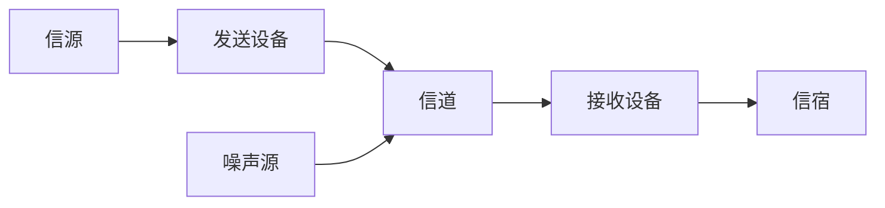

# 计算机网络  

[TOC]

## 一.什么是计算机网络  
* 计算机网络 = 通信技术 + 计算机技术
* 通信系统模型：

**信源** ：发生、产生信息		**信宿**：信息到达的地方  

* 计算机网络就是一种**通信网络**

* 定义：计算机网络就是**互连**的、**自治**的计算机集合。
  * **自治** ：无主从关系
  * **互联** ：互联互通
    * 通信链路  

* 距离远、数量大怎么保证互连？
  * 通过**交换网络**互连主机
    * 交换节点：路由器、交换机

## 二.什么是Internet 

* 全球最大的互联网
  * ISP(Internet Service Provider)网络互连的“网络之网络”
* 互联网：数以百万计的**计算设备**集合：
  * 主机（host） = 端系统（end systems）
  * 运行各种网络应用
  * 各种主机通过**通信链路**连接在一起
    * 通信链路：光纤、铜缆、无线电、卫星
  * 分组交换：转发分组（数据包）
    * 路由器、交换机
* 互联网（服务角度）：为网络应用提供通信服务的通信基础设施
  * 为网络应用提供应用编程接口（API）

## 三.什么是网络协议

* **硬件** （主机、路由器、通信链路等）是计算机网络的基础

* 计算机网络中的数据交换必须遵守实现约定好的**规则** 

  硬件：道路 	规则：交通法则

* **网络协议**：为进行网络中的数据交换而建立的规则、标准或约定

  * 协议规定了通信实体之间所交换的消息的**格式、意义、顺序** 以及收到信息或发生的事件所采取的“**行动**”
  * **协议三要素**
    * 语法（Syntax）
      * 数据与控制信息的结构或格式
      * 信号电平
    * 语义（Semantics）
      * 需要发出何种控制信息
      * 弯沉何种动作以及做出何种响应
      * 差错控制
    * 时序（Timing）
      * 事件顺序
      * 速度匹配
  * RFC文档：官方文档

## 四.计算机网络结构

1. **网络边缘**
   1. 主机
   2. 网络应用
2. **接入网络，物理介质**
   1. 有线或无线通信链路
3. **网络核心（核心网络）**
   1. 互联的路由器
   2. 网络之网络

### 一.网络边缘

* 主机（端系统）：
  * 位于“网络边缘”
  * 运行网络应用程序
* 客户/服务器应用模型
  * 客户发送请求，接收服务器响应
    * 如：Web应用，文件传输FTP应用
* 对等（P2P）应用模型
  * 无专用服务器
  * 通信在对等实体之间直接进行
    * 如：QQ

### 二.接入网络

* 将网络边缘接入核心网
* 分类
  * 家庭接入网络
  * 机构接入网络
  * 移动接入网络
* 用户关心：
  * 带宽（bps）：每秒传输速率
  * 共享/独占？
* 举例：
  * 数字用户线路（DSL）
    * 多路复用技术
  * 电缆网络
    * HFC：混合光纤同轴电缆
    * 非对称：下行（下载）：30Mbps  上行（上传）：2Mbps
    * 共享
  * 家庭接入网络
  * 机构接入网络
    * 以太网
  * 无线接入网络
    * 无线局域网（wifi）
  * 广域无线接入
    * 蜂窝网（移动网络）：3G、4G

### 三.网络核心

* 互联网的路由器网络
* 网络核心的关键功能：**路由+转发**
  * 路由（routing）：确定分组从源到目的传输路径（查**路由转发表**）
    * 路由算法：形成本地转发表（路由转发表）
  * 转发（forwarding）：将分组从路由器的输入端口交换至正确的输出端口
* 网络核心解决的基本问题
  * 如何实现数据从源主机通过网络核心送达目的主机
    * 数据交换

### 四.Internet结构：网络之网络

* 端系统（主机）通过接入ISP连接到Internet
* 接入ISP必须进一步互连
  * 保证两个主机之间可以互相发送分组
* 构成复杂的网络互连的网络

## 五.数据交换

* 实现数据通过网络核心从源主机到达目的主机
* N^2链路问题
  * 所有主机之间都有一条链路（链路消耗大）
  * 解决方案：**交换设备**
* 交换设备
  * 无法保证连通性和网络规模
  * 解决方案：**交换网络**
* 交换网络
  * 由交换设备组成的网络
  * 动态链接
    * 可以将一个端口的数据转移到另一个端口
  * 动态分配传输资源
    * 数据从源主机通过交换网络正确的送到目的主机

### 1.数据交换的类型

* 电路交换
* 报文交换
* 分组交换

#### 电路交换

* 电路交换的特点
  * 最典型的电路交换网络：电话网络
  * 电路交换的三个阶段
    * 建立连接（呼叫 /电路建立）
    * 通信
    * 释放连接（查出电路）
  * 最重要特点：**资源独享**
* 电路交换网络的链路共享
  * 如何共享中继线
    * **多路复用技术**

##### 多路复用技术

* 多路复用（multiplexing）简称复用，是通信技术中的基本概念
* 共享信道（例如电话、网络共用一条信道）
* **多路复用**
  * 把链路/网络资源（如宽带）划分为“资源片“
  * 将资源片分配给各路呼叫
  * 每路呼叫独占分配到的资源片进行通信
  * 资源片可能”闲置“
* 典型多路复用技术
  * 频分多路复用
  * 时分多路复用
  * 波分多路复用
  * 码分多路复用

###### 频分多路复用

* 根据频率分配信道
  * 频分多路复用的用户占用不同的宽带资源
  * 用户在分配到一定的频带后，在通信过程中始终都占用这个频带

###### 时分多路复用

* 把信道使用时间划分为一段段等长的时分复用帧，每个用户在每个TDM帧中占用固定序号的时隙
  * 每用户所占用的时隙周期出现的
  * 在同一频率传送数据

###### 波分多路复用

* 波分复用就是光的频分复用

###### 码分多路复用（CDM）

* 广泛运用于无线链路共享（蜂窝网、卫星信号）
* 为每个用户分配一个唯一的m比特的码片序列。（由-1（0），+1（1）组成）
* 各用户使用相同频率载波，利用各自码片序列编码数据
  * 编码信号 = （原始数据）* （码片序列）
  * 各用户码片序列相互正交
* 共享信道、互不干扰
  * 所有用户发送数据后，数据会叠加，接收用户需要通过**解码**接收数据
    * **解码**：发送用户的码片序列与编码信号的内积

#### 报文交换

* **报文**：源（应用）发送信息整体（一个文件）

#### 分组交换（统计多路复用）

* **分组**：报文拆出来的一系列相对较小的数据包
  * 需要报文的拆分和重组
  * 产生额外开销（时间、头部信息）
  * 最大特点：**按需分配链路**
  
* 报文交换、分组交换均采用存储、转发交换方式
  * 区别
    * 报文交换以完整报文进行“存储-转发”
    * 分组交换以较小的分组进行“存储-转发”
  * 哪种更好呢？

* **传输延迟** 

  * 从发送第一比特分组开始，到发送最后一比特分组之间的时间
  * **分组交换在空间和时间上都优于报文交换** 

  
